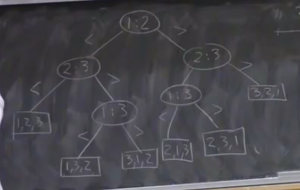

[Back to index](index)

#  Lower Bounds on Sorting

## How fast can we sort a list?

Suppose the list has size $n$

- even though there are $\frac{1}{2}(n^2 - n)$ pairs of keys in the list, we do not need $\Omega(n^2)$ time to sort because we do not need to compare *every* two keys
  - e.g. in quicksort, if we are partitioning the list based $p$ and we find that $a < p$ and $p < b$, then $a$ and $b$ are never compared - this is the key to the efficiency of quicksort
- we have seen algorithms that sort in $\Theta(n \log(n))$ time, but we have not seen any faster algorithms
- we want to investigate if it is fundamentally impossible to sort a list in faster than $n \log(n)$ time using a comparison-based algorithm
  - comparison-based algorithms include selection sort, quicksort, etc - these compare keys in the list
  - non-comparison-based algorithms include bin sort - this algorithm does not compare entries, it uses properties of the keys to bypass comparisons

## Decision Trees

- each vertex of the tree has a comparison between two distinct items in the list
- each child node represents the next "decision" that must be made in order to determine the order of the list

- here, $1$, $2$, and $3$ represent the first, second, and third keys in the list that the algorithm deals with
- the output of the algorithm is a permutation of the input so that it is in sorted order, so the leaves of the decision tree are all of the permutations of the list

- any binary tree with $\ell$ leaves has height $h \geq \lceil \log_2(\ell) \rceil$
- a sorting decision tree $T_n$ for $n$ keys has at least $n!$ leaves, as the leaves are permutations and there are $n!$ permutations, therefore $height(T_n) \geq \lceil \log_2(n!) \rceil$, so $height(T_n) \in \Omega(n\log(n))$
- the height of a decision tree is the length of the longest path from root to leaf, aka the number of decisions in the worst case

Therefore the worst case running time of a comparison-based sorting algorithm is $\Omega(n \log(n))$

### Implications

- every comparison-based sorting algorithm has a case where it needs to take at least $n \log(n)$ time
  - algorithms may still have better cases, e.g. bubble sort is linear if one item is out of place, but $n \log(n)$ is a lower bound on the *worst* case
- heapsort and mergesort are optimal in the worst case, as they always take $\Theta(n \log(n))$ time

